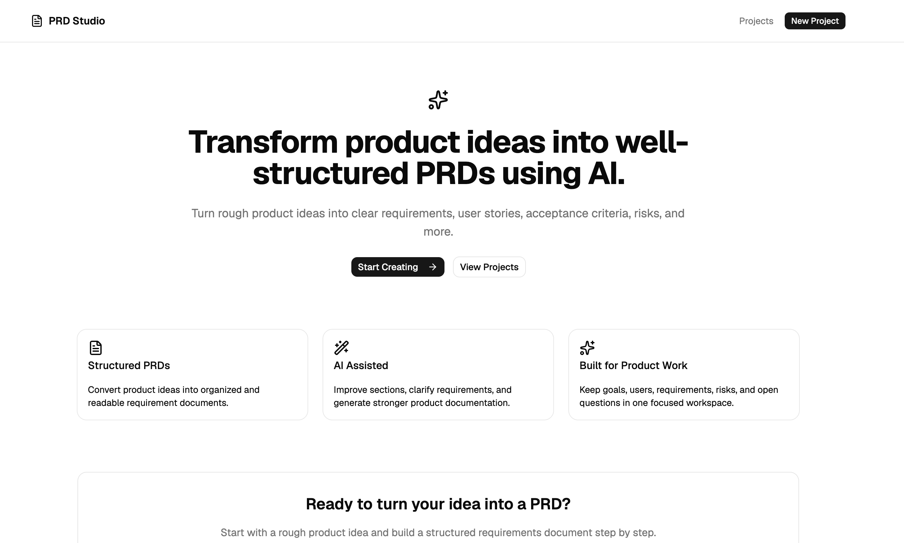
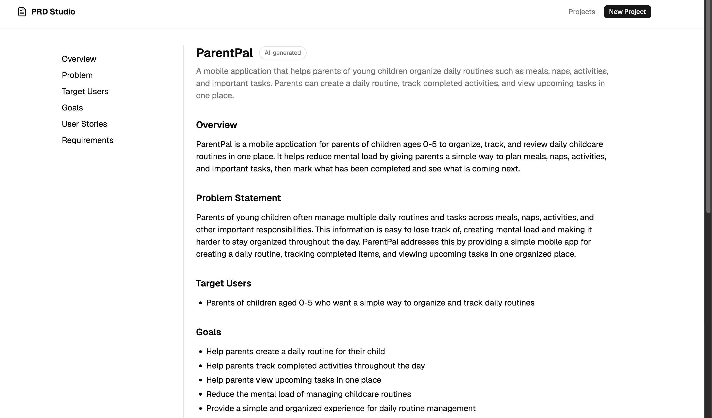
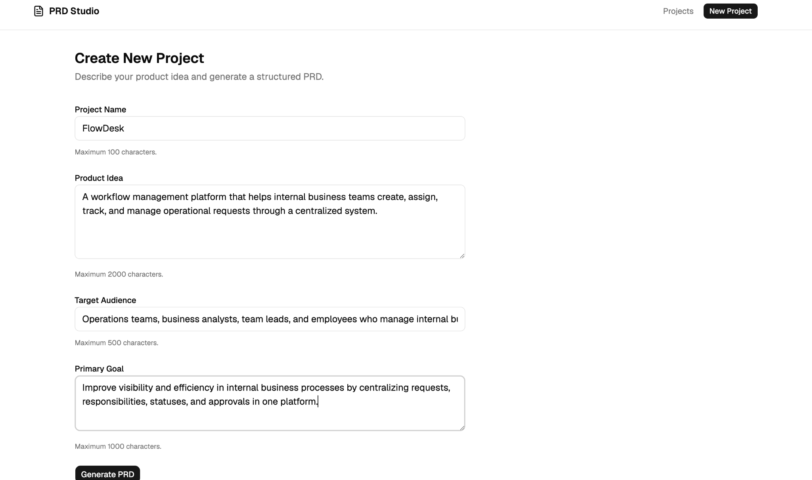
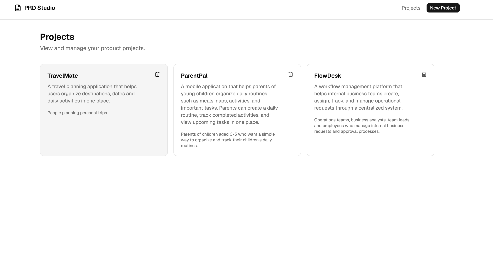

# AI PRD Studio

AI PRD Studio is a full-stack application that turns a rough product idea into a structured Product Requirements Document (PRD) using OpenAI.

Users can create a product project, generate an AI-powered PRD, persist the project and generated PRD in PostgreSQL, and view the result in a dedicated workspace.


## Screenshots

### Landing Page



### AI-Generated PRD Workspace



### Create a New Project



### Project Management



## Tech Stack

### Frontend

- React
- TypeScript
- Vite
- React Router
- TanStack Query
- React Hook Form
- Zod
- Tailwind CSS
- shadcn/ui

### Backend

- Node.js
- Express
- TypeScript
- PostgreSQL
- Prisma
- OpenAI API
- Zod

## Features

- Create product projects
- Generate structured PRDs with AI
- Validate structured AI responses
- Store projects and generated PRDs in PostgreSQL
- View generated PRDs in a project workspace
- Loading, error, and retry states
- Frontend and backend input validation
- AI provider error handling
- Protection against empty or invalid AI responses

## Project Structure

```text
ai-prd-studio/
├── src/                    # React frontend
├── server/                 # Express backend
│   ├── prisma/             # Prisma schema and migrations
│   └── src/                # Backend source code
├── .env.example
└── README.md
```

## Prerequisites

Before running the project, make sure you have:

- Node.js
- npm
- PostgreSQL
- An OpenAI API key

## Frontend Setup

Install frontend dependencies:

```bash
npm install
```

Create the local frontend environment file:

```bash
cp .env.example .env
```

The frontend environment file should contain:

```env
VITE_API_BASE_URL=http://localhost:3001
```

Start the frontend:

```bash
npm run dev
```

The frontend runs by default at:

```text
http://localhost:5173
```

## Backend Setup

Move into the backend directory:

```bash
cd server
```

Install backend dependencies:

```bash
npm install
```

Create the local backend environment file:

```bash
cp .env.example .env
```

Configure the following environment variables:

```env
PORT=3001
DATABASE_URL=postgresql://YOUR_USERNAME@localhost:5432/ai_prd_studio?schema=public
OPENAI_API_KEY=your_openai_api_key_here
```

Replace `YOUR_USERNAME` with your local PostgreSQL username and provide your own OpenAI API key.

Do not commit real API keys or local `.env` files to the repository.

## Database Setup

Make sure PostgreSQL is running and create a database named:

```text
ai_prd_studio
```

From the `server` directory, apply the Prisma migrations:

```bash
npx prisma migrate dev
```

Generate the Prisma client:

```bash
npx prisma generate
```

## Run the Backend

From the `server` directory:

```bash
npm run dev
```

The backend runs by default at:

```text
http://localhost:3001
```

The API health endpoint is:

```text
GET /api/health
```

## AI Configuration

PRD generation is handled by the backend.

The frontend does not communicate directly with OpenAI and does not have access to the OpenAI API key.

The backend reads the API key from the following environment variable:

```env
OPENAI_API_KEY
```

AI responses are generated in a structured PRD format and validated before being accepted by the application.

## AI Generation Flow

```text
User fills in project form
        ↓
Frontend sends PRD generation request
        ↓
Backend validates input
        ↓
OpenAI generates structured PRD
        ↓
Backend validates AI output
        ↓
Project and PRD are stored in PostgreSQL
        ↓
Frontend opens the Project Workspace
```

## Environment Files

Example configuration files are included in the repository:

```text
.env.example
server/.env.example
```

Real environment files are ignored by Git:

```text
.env
server/.env
```

Never store real secrets inside `.env.example` files.

## State Management

The application uses:

- React Hook Form for form state
- TanStack Query for server state and API mutations
- Local React state for temporary UI state
- Zod for runtime validation

Zustand is not used unless global client state becomes necessary.

## Development Status

The current version supports the complete flow from product idea input to AI-generated PRD persistence and workspace rendering.

## License

This project is currently intended for learning, portfolio, and development purposes.

## Current Version

**V1 — AI-powered PRD Generation**

The first version of AI PRD Studio focuses on the core workflow:

Product Idea → AI-generated PRD → Validation → Persistence → Project Workspace

V1 is a functional MVP and the project will continue to evolve with additional product analysis and documentation capabilities.

## Roadmap / To-Do

Planned improvements for future versions:

- [ ] Generate visual diagrams from project requirements
  - BPMN process diagrams
  - Data Flow Diagrams (DFD)
  - User flow diagrams

- [ ] Allow users to edit AI-generated PRD sections

- [ ] Regenerate individual PRD sections instead of the entire document

- [ ] Add PRD version history and change tracking

- [ ] Export PRDs as PDF / Markdown

- [ ] Add project search and filtering

- [ ] Add authentication and user workspaces

- [ ] Add AI-assisted requirement refinement

- [ ] Detect ambiguous or missing requirements and suggest clarification questions

- [ ] Generate additional Business Analysis artifacts
  - Business Rules
  - Use Cases
  - Acceptance Criteria
  - Stakeholder Analysis

- [ ] Improve responsive/mobile experience

- [ ] Add automated frontend and backend tests

- [ ] Deploy the application for public access